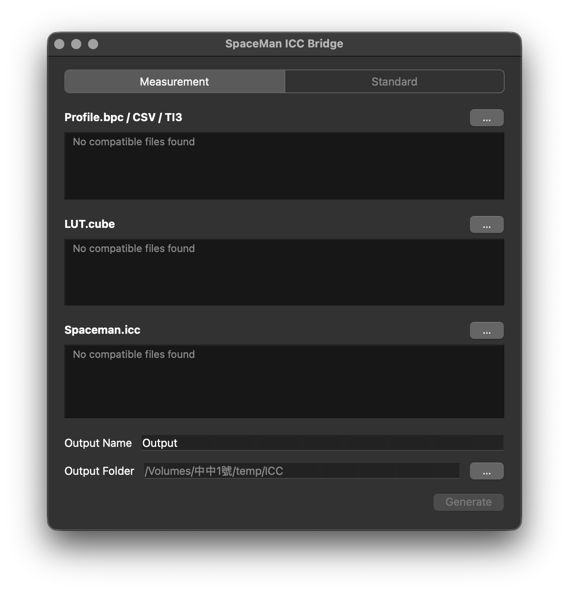

# SpaceMan ICC Bridge

A desktop tool for creating display ICC profiles from ColourSpace measurements or an existing display ICC profile.

SpaceMan ICC Bridge creates a regular display ICC profile for macOS ColorSync and a Windows MHC2 ICC profile from the same settings.



---

## Features

- Create profiles from ColourSpace measurements and a CUBE LUT (1D or 3D)
- Read ColourSpace BPC/BCS, DisplayCAL/Argyll TI3, and supported CSV measurement files
- Create profiles from a standard matrix/TRC display ICC without measurement files
- Set target gamut, white point, and gamma
- Generate both `name.icc` and `name-mhc2.icc` on macOS and Windows
- Drag and drop files or folders into the source lists

---

## Download

[Download from Releases](https://github.com/yuchungchen1214/spaceman-icc-bridge/releases)

### Applications

**macOS**
- Apple Silicon (arm64)

**Windows**
- x64 single-file application: `SpaceMan ICC Bridge.exe`

Release downloads are published separately from the source repository. Check the Releases page for available builds.

### Run from source

Requires Python 3.11 or later. Install the Python dependencies, then run:

```bash
python -m pip install -r requirements.txt
python preview_v110.py
```

The MHC2Gen helper required to create the Windows profile is included for macOS and Windows. The Windows executable is built with `packaging/windows/SpaceMan.spec`; the macOS application is built with `packaging/macos/SpaceMan.spec`.

For a description of Standard mode and the two generated profiles, see [`docs/standard-dual-output.md`](docs/standard-dual-output.md).

---

## Notes

- `name.icc` describes the calibrated display for macOS ColorSync and conventional ICC color management.
- `name-mhc2.icc` contains the Windows MHC2 data for compatible Windows display workflows.
- In Standard mode, the selected display ICC must describe the display's current hardware mode. This mode does not measure the display.
- Standard mode's target gamut is applied to the Windows MHC2 profile. The regular ICC describes the display's actual gamut for color-managed applications.
- Display accuracy depends on the source profile, display state, and operating-system color-management behavior. Verify profiles on the intended system and display.

---

## License

Copyright (C) 2026 Yu-Chung Chen. Licensed under the GNU Affero General Public License, version 3 or (at your option) any later version. See [`LICENSE`](LICENSE).
